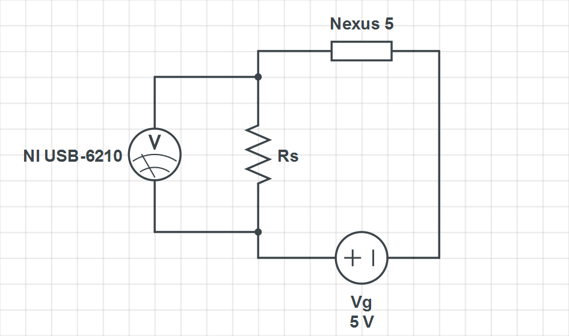

# Circuit

# Instruments
## [FriedCircuits USB Tester 2.0](http://friedcircuits.us/46)
This USB tester produced by FriedCircuitus is an Arduino board capable of measuring voltage and current. The provided applications (Java and Chrome extension) allows one sampling over 150 ms, too low for accurate results. Thus, this tester will be used only to have an initial idea of the values for voltages and currents.

## [National Instruments USB-6210](http://sine.ni.com/nips/cds/view/p/lang/it/nid/203223)
The *NI USB-6210* is a multifunctional DAQ that allow up to 250 kS/s, enough for the power consumption analysis. For full specification, please refer to the official [datasheet](http://www.ni.com/datasheet/pdf/en/ds-9).

*LabView SignalExpress 2011* is the software trough whitch data is acquired.

# Shunt Resistor analysis
Due to the circuit configuration, the chose of the resistor has a great impact on the test and the data. It is placed in series to the device, hence, from the Ohm law, the flowing current is the same that is absorbed by the phone. This current produce a voltage drop on the resistor equal to:
>(1) Vr = R \* I
Where Vr is the voltage on the resistor, R is the resistor and I the current.

Consequently, the voltage on the phone is:
>(2) V = Vg - Vr
Where V is the voltage on the Nexus 5, Vg is the generator and Vr is the voltage on the resistor.

In order to have the smallest possible variation on V, it is necessary to minimize the value of Vr. This is achieved by reducing the value of R from the formula (1). Of course, in a ideal situation R should be 0 Ohm.

Data acquired with the Arduino board shows peaks of current of about 1.2 A, then this vaue is considered like a upper bound for the dimensioning of the resistor. To have an idea, three different value of voltage drop (Vr) have been considered: 0.1 V, 0.5 V and 0.01 V:
>(3) R = Vr / I = 0.1 V / 1.2 A = 0.08864 Ohm
>(4) R = Vr / I = 0.05 V / 1.2 A = 0.04432 Ohm
>(5) R = Vr / I = 0.01 V / 1.2 A = 0.00886 Ohm
These values of Vr give, respectively, the following relative fluctuation on the 5V generated by Vg: 2%, 1% and 0.2%. Then it is possible to almost ignore this error when calculating the power because they are not relevant. But the (5) require a very small resistor that is difficult to buy and that can lead to consider the resistance of the cables. Since (4) has half the fluctuation within respect to (3) and it is easier to find, this is the resistor that will be used.

The real resistor used in this thesis is a *Bourns PWR4412-2SCR0500F*: 50 mOhm resisance, 1% tolerance, 3 Watt power rating.

With this resistor, using (1), the maximum voltage drop should be 0.06V, equivalent to 1.2% variation over the 5V generated by Vg. The dissipated power is equal to:
> (6) P = R \* I^2 = 0,072 W

# Data acquisition procedure
LabView 2011 is configured to acquire data from the National Intruments board. In order to ge enough data, 100 samples are acquired at 1 kHz frequency.

To make easier the identification of the data zone, a pattern of busy-sleep-busy is used. This pattern is composed of three states: two sleep states and one busy state. In the sleep state, the processor perform no computation, so it is possible to observe the minimum power level consumption. The busy state, instead, is implemented in a busy form of waiting, so there is the highest power level consumption. Busy and sleep duration have the same duration, making them even more easier to identify.

For each system call, the acquisition is repeated 30 times. Each time, the binary calls the same function more than 10000 times. This will reduce eventual "noise".

Results are exported and will be analyzed later.

# Considerations
* Scaling (governor)
* Number of involved cores?